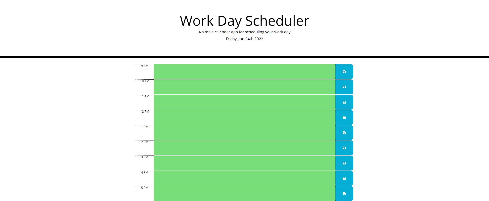

# Work-Day-Scheduler
- I used the fonts from googleapis and the button from font awesome like in the example that was given to us.
- I was also able to create the divs and buttons toa similar size and aspect to the example given as well.
- Could not figure out how give it more space at the bottom of the window to not make it as cramped though.
- Used a different format for the time at the header of the page so it would be more detailed with the date AND time.

[WorkDayScheduler](https://iamfalziii.github.io/Work-Day-Scheduler/)